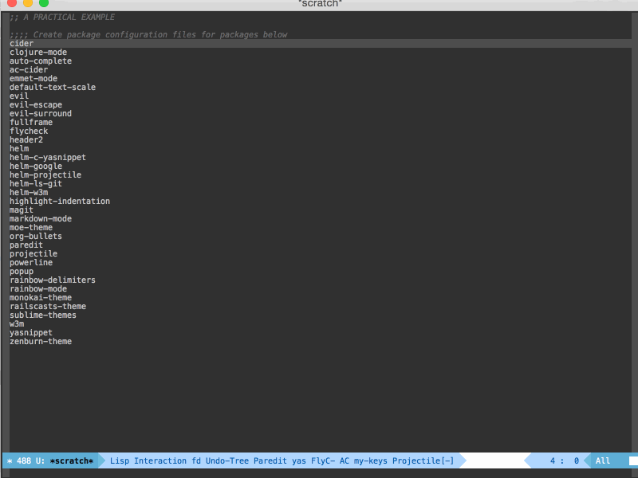
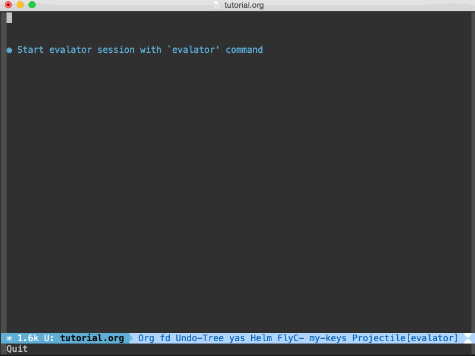

[](https://melpa.org/#/evalator)
[](http://stable.melpa.org/#/evalator)


# EVALATOR #

## Introduction ##

Evalator is a new kind of REPL for Emacs.

What makes it different from a normal REPL?  With evalator you can:

*  Evaluate expressions using any language<sup>*</sup>
*  See the results of an expression as it is typed
*  Transform data in a stepwise fashion
*  Generate code
*  Interact with Emacs using a language other than Elisp

<sup>*</sup> Provided you've installed the appropriate extension package.

### Language Support ###
By default, evalator uses Elisp as its evaluation language, but it
supports other languages through extension packages.  These packages
define an evaluation context that can be passed to the ```evalator```
command in order to set the evaluation language for that particular
session.

#### Currently available evaluation contexts ####
*  Clojure - via [evalator-clojure](https://github.com/seanirby/evalator-clojure)

Don't see a context package for your favorite language?  Write one!
See
[evalator-elisp.el](https://github.com/seanirby/evalator/blob/master/evalator-elisp.el)
and
[evalator-clojure.el](https://github.com/seanirby/evalator-clojure/blob/master/evalator-clojure.el)
for examples.  Open an issue in this repo with any questions and I'll
be happy to help.

Here's a practical example to demonstrate what evalator's capable of:

### A Practical Example ###
Suppose you have several Emacs packages and want to generate an elisp
configuration file for each one in your current directory.  Each file
should be named ```setup-$PACKAGE.el``` with ```$PACKAGE``` equaling
the package name.  Each file should contain the following line.

```
(provide 'setup-$PACKAGE)
```

Watch the example below to see how easy this is with evalator.



Here's what happened:

* Copy all package names
* Call ```M-x evalator``` to start an evalator session
* Paste the package names into a lisp list ```'()```
* Build a string for the shell command I want executed for each package
* Call the Emacs command ```shell-command``` with each of the strings from before
* Exit evalator using <kbd>C-g</kbd>
* Verify the files are created with the right contents

See the [Basic Usage](#basic-usage) section for a detailed
walkthrough.

## Installation ##

Evalator is available through the [MELPA](http://melpa.org/)
repository.  You can install it by using Emacs's built-in package
manager ```package.el```.

If you haven't configured ```package.el```, see
[here](https://github.com/milkypostman/melpa#usage) for a short guide
on setting it up to use MELPA.

Once configured, you can run ```M-x package-install``` then enter
```evalator``` to install evalator.

## Setup ##

### Minimal ###

Add the following to your init file to setup key bindings for the
primary evalator commands.

```
;;Suggested keybindings
(global-set-key (kbd "C-c e e") 'evalator)
(global-set-key (kbd "C-c e x") 'evalator-explicit)
(global-set-key (kbd "C-c e r") 'evalator-resume)
(global-set-key (kbd "C-c e i") 'evalator-insert-equiv-expr)
```

### <a name="setup-auto-detect-context"></a>Auto Detect Context###

If you've installed packages that provide other evalaution context's
for evalator, you may want it to automatically detect what evalaution
context to use.  For example, if you're in a buffer using
```ruby-mode``` then you'd like your ```evalator``` session to use
Ruby.  Likewise, if you're in a buffer using ```clojure-mode``` then
use Clojure.

```
(setq evalator-config-mode-context-alist nil)
(add-to-list 'evalator-config-mode-context-alist '(ruby-mode . evalator-ruby-context))
(add-to-list 'evalator-config-mode-context-alist '(clojure-mode . evalator-clojure-context))
```

```evalator-config-mode-context-alist``` is an association list(alist) of
pairs with the following form:

```'(MAJOR-MODE . CONTEXT)```

```evalator``` uses this alist in determining what context to use for
a session.  If a context wasn't passed explicity in a call to
```evalator``` or ```evalator-explicit```, then the current buffer's
major-mode is searched for within the alist. If an entry is found, the
context associated with that major-mode is used for the session.
Otherwise an elisp evaluation context is used.

## <a name="basic-usage"></a> Basic Usage ##



### Basic Usage ###

*Help is available anytime in an evalator session by running <kbd>C-h
m</kbd>*.  This will open a buffer containg help for evalator followed
by help for helm.

Start evalator by typing ```M-x evalator```.  A helm buffer will be
opened with a prompt to enter an expression.  Enter a valid expression
to generate the initial "candidates".  A candidate is simply a result
that is displayed.  We call them candidates to stay consistent with
helm, which evalator uses as a front-end.  Once you've entered a valid
expression press <kbd>RET</kbd> to confirm your expression.

Evalator provides immediate feedback by attempting to evaluate your
expression as it is typed. As soon as you've entered a valid
expression the candidates are updated to show what their new value
will be if you confirm your expression.  Your expression prompt also
will change color from red to green to indicate its validity.

Obviously you can only confirm your expression when the expression is
valid.  If you try confirming an invalid expression the error message
is displayed in the echo area.

You can further transform the candidates you've generated by typing
more expressions.  Subsequent expressions are executed on each
candidate.  That is evalator's behavior in normal mode.  You may
refer to the current candidate by inserting the special arg character
into your expression by pressing <kbd>C-c ;</kbd>.

Modes and special args will be explained in more detail in the
following sections.

#### Modes ####
You can start an evalator session with either ```M-x evalator``` or
```M-x evalator-explicit```.  These commands start an evalator session
in either normal mode or explicit mode, respectively.

To explain the difference between these two modes, we first need to
define what a "candidate" is.  If evalator was started in normal mode
(```M-x evalator```) and the result of an expression is an atomic
value like an integer or string, then the result will be displayed as
a single candidate.  If the result is a collection like a list or
vector, then each of the elements of that collection are displayed as
a separate candidate.

If evalator was started in explicit mode (```M-x evalator-explicit```)
then the result is always displayed as a single candidate.  One
benefit to using explicit mode is that you can generate the equivalent
code of a session using ```M-x evalator-insert-equiv-expr``` and
insert that into a buffer<sup>*</sup>.

So how do you choose what mode to use?

Use normal mode if you want to transform collection data and you don't
care about code generation.

Use explicit mode otherwise.

<sup>*</sup> The implementation of ```evalator-insert-equiv-expr``` is
pretty naive currently so it's output may be sub-optimal if you used
numbered special args like ```Ⓔ0``` in any of your expressions.

#### Special Args ####

When writing an expression in evalator, you use a special arg to refer
to a particular candidate.  You can easily insert this arg into the
the expression prompt by pressing <kbd>C-c ;</kbd>, which is the key
binding for ```evalator-action-insert-special-arg```.  This arg is the
character ```Ⓔ``` by default.  If the last element was a collection
then adding an integer N after the special arg, causes the Nth element
from that candidate to be substituted.

Here's what you would add to make the elisp context use ```@``` as
its special arg:

```
(setq evalator-elisp-special-arg "@")
```

Or you could change the default special arg globally with the
following:
```
(setq evalator-context-special-arg-default "@") 
```

### Public API ###

The commands below can be bound to a shortcut or executed using ```M-x```

```evalator``` - Starts an evalator session

```evalator-explicit``` - Starts an evalator session in explicit mode

```evalator-resume``` - Resumes last evalator session

```evalator-insert-equiv-expr``` - Inserts the equivalent expression of the last evalator session into the current buffer. NOTE: The last session must have been run in explicit mode for this to work.


### Key Actions ###
Below is a table of evalator specific key actions that can be used
within the evalator session.  For helm specific commands such as
candidate navigation and marking, refer to
[helm's](https://github.com/emacs-helm/helm) documentation or run
<kbd>C-h m</kbd> to open a help buffer that contains evalator help
followed by helm help.

Shortcut                        | Command and Description
------------------------------- | -----------------------
<kbd>RET</kbd>                  | ``uevalator-action-confirm-make-or-transformu``</br></br>Accepts initial candidates or transformation then updates history.  If transforming candidates, the expression is evaluated on each candidate with the special arg referring to the candidate's value
<kbd>C-c ;</kbd> <kbd>C-;</kbd> | ```evalator-action-insert-special-arg```</br></br>Insert's the current evaluation context's special arg.
<kbd>C-c C-c</kbd>              | ```evalator-action-confirm-transform-collection```</br></br>Accepts transformation and updates history. Expression is evaluated once awith the special arg referring to the selected candidates list
<kbd>C-c C-e</kbd>              | ```evalator-action-execute-in-elisp```</br></br>Executes the expression in Elisp on each selected candidate.  The history is not updated and the candidates are not transformed
<kbd>C-j</kbd>                  | ```evalator-action-next```</br></br>Goes to next history state
<kbd>C-l</kbd>                  | ```evalator-action-previous```</br></br>Goes to previous history state

You can exit the evalator session by quitting the minibuffer.  This command is usually bound to <kbd>C-g</kbd>.
