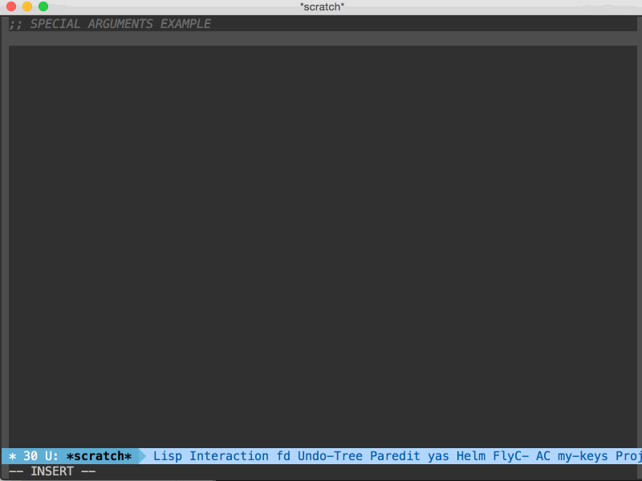
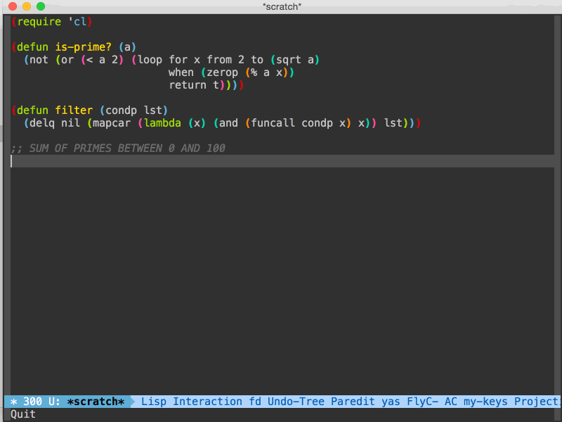

# EVALATOR #

## Introduction ##

Evalator is an Emacs plugin built on top of Helm that allows for interactive evaluation and transformation of data.  You can use Evalator for several things but here's a few:

* Test a calculation
* Generate code
* Build and execute a complex shell command
* Interact with Emacs from a non-Elisp environment

Lets go through a few examples to see what Evalator can do.
 (setq browse-url-browser-function 'w3m-browse-url)

### Example 1 ###


Upon starting any evalator session you must first provide an expression to generate the initial data.  In this example, the expression ```(list 0 1 2 3)``` is used to generate the integers 0 through 3.  Notice that the prompt is red until a valid expression is entered.  I then press ```RETURN``` which is bound to the command ```evalator-action-confirm```.  This will evaluate my expression, store the result, and prompt me to enter a new expression.  Now I enter an expression to add 1 to every integer.  You'll notice that I entered a special character ```Ⓔ```.  In normal operation, evalator evaluates the expression on each item and ```Ⓔ``` refers to the value of that item.  The special arg is customizable for each evaluation context and it can be quickly entered using the the shortcut, ```C-;```, which is bound to the command ```evalator-action-insert-special-arg```.  I confirm this transformation and enter a new expression ```(cons Ⓔ (list Ⓔ))```.  This adds the number to a list containing itself.  After confirming this transformation,  I select the first and third items, then enter the expression ```(car 'Ⓔ)``` which takes the first element from the list.  Note the quotation before the special arg.  The special arg refers to the item value, and since ```(car (1 1))``` is an invalid expression, the quote must be added to prevent ```(1 1)``` from being evaluated.  After I confirm the transformation, you'll see that only the items I've marked appear in the next step.  Finally,  I select all candidates using ```M-a```(helm-mark-all) and then insert them into the buffer above using ```C-c TAB```(helm-copy-to-buffer).

### Example 2 ###


In the example above an evalator session is opened to find the sum of primes between 0 and 100.  The first expression entered in the evalator evalator generates the initial integer list.  The next expression uses the ```filter``` and ```is-prime?``` functions defined in the file to filter the candidate list.  For this example, I'd like to have ```Ⓔ``` refer to the value of the entire list.  To do this, I first select the entire list using the helm mark-all shortcut, ```M-a```.  I then enter the shortcut bound to ```evalator-action-confirm-collect```, ```C-c C-c```.  This will cause the input expression to be applied over the entire selection rather than each item individually.  Now that I have the list of primes between 0 and 100, I use the same process as before and reduce the entire list with a sum function to get the final result.  Finally, I exit the evalator session and insert the equivalent expression of the session using ```evalator-insert-equiv-expr```.


Suppose you wanted to generate several configuration files in your current directory.  The files should be named "setup-windows.el", "setup-keys.el", and "setup-packages.el".  Each file should look like the following:
```
;; setup-windows.el
(provide 'setup-windows)
```

You can do this manually but that would be inefficient.  With Evalator you can do this quickly.  See below:

*INSERT GIF HERE*

Evalator isn't just limited to Elisp.  If you've installed the appropriate context package you can use Evalator in any language you'd like.  In the following example, I'm working in a Clojure file and I'd like to filter the even numbers from a list of integers, convert them to strings, and then concatenate the result.  Unfortunately, I've forgotten the function that converts data to a string.  I exit Evalator to lookup the function, copy it, restart Evalator, and paste the function back into my expression.  Once I'm satisfied with my result, I exit Evalator and insert the equivalent code of the entire session into my Clojure file.

*INSERT GIF HERE*

What if you made a mistake?  Suppose you wanted to filter the odd numbers instead of the even ones.  Evalator lets you move backwards and forwards throughout the session so you can edit any expression in the evaluation history.

*INSERT GIF HERE*

As you can see, Evalator is quite powerful.  It is similar to using a REPL, but instead of executing only a single expression at a time, Evalator lets you incrementally build a result based off of as many commands as you'd like.

## Installation ##
## Setup ##
## Basic Usage ##
### Special Arguments ###
### History ###
### Normal Mode ###
### Explicit Mode ###
## Language Support ##
Evalator ships with an Elisp evaluation context, but it is built to support any language that can be evaluated within Emacs.  See [here](https://github.com/seanirby/evalator-context-cider) for a Clojure/Clojurescript evaluation context using CIDER.

